# Laporan Tugas Reimplementasi Teknologi Basis Data
---
> Nama : Anasthashya Rachman \
> Nim : 121450013 \
> Kelas : RB
---

- Task
Reimplementasi artikel " Three Ways of Storing and Accessing Lots of Images in Python ".\
Source https://realpython.com/storing-images-in-python/ 

## Pendahuluan 
Dalam pemrosesan data gambar menggunakan Python, kebutuhan akan penyimpanan yang efisien dan akses yang cepat menjadi krusial. Artikel ini akan membahas tiga metode umum yang digunakan untuk menyimpan dan mengakses banyak gambar dengan Python.

Metode pertama adalah penyimpanan pada disk, yang merupakan pendekatan paling sederhana dan umum digunakan. Dalam metode ini, setiap gambar disimpan sebagai file terpisah di sistem file, memungkinkan akses yang mudah dan langsung.

Metode kedua menggunakan LMDB (Lightning Memory-Mapped Database), sebuah basis data berbasis peta memori yang sangat efisien dan cepat. Dengan LMDB, gambar-gambar disimpan sebagai nilai dalam basis data, yang memungkinkan akses yang cepat dan efisien.

Metode ketiga melibatkan penggunaan h5py (HDF5 for Python), sebuah pustaka Python yang digunakan untuk bekerja dengan format data HDF5. Dalam konteks ini, h5py digunakan untuk menyimpan gambar-gambar sebagai dataset dalam file HDF5, yang memungkinkan pengelolaan data besar dengan struktur hierarki.

Dalam setiap bagian artikel, akan dijelaskan cara mengimplementasikan metode penyimpanan yang sesuai menggunakan metode tersebut. Dengan memahami ketiga pendekatan ini, pembaca akan memiliki pengetahuan yang diperlukan untuk memilih metode penyimpanan yang sesuai dengan kebutuhan proyek, serta untuk mengoptimalkan kinerja dan efisiensi saat bekerja dengan banyak gambar dalam lingkungan Python.

## Pembahasan 
### Prepare Data

```
import numpy as np
import pickle
from pathlib import Path

import matplotlib.pyplot as plt
print(plt.style.available)


# Path to the unzipped CIFAR data
data_dir = Path("H:/download 2/cifar-10-python/cifar-10-batches-py")

# Unpickle function provided by the CIFAR hosts
def unpickle(file):
    with open(file, "rb") as fo:
        dict = pickle.load(fo, encoding="bytes")
    return dict

images, labels = [], []
for batch in data_dir.glob("data_batch_*"):
    batch_data = unpickle(batch)
    for i, flat_im in enumerate(batch_data[b"data"]):
        im_channels = []
        # Each image is flattened, with channels in order of R, G, B
        for j in range(3):
            im_channels.append(
                flat_im[j * 1024 : (j + 1) * 1024].reshape((32, 32))
            )
        # Reconstruct the original image
        images.append(np.dstack((im_channels)))
        # Save the label
        labels.append(batch_data[b"labels"][i])

print("Loaded CIFAR-10 training set:")
print(f" - np.shape(images)     {np.shape(images)}")
print(f" - np.shape(labels)     {np.shape(labels)}")
```
Kode di atas adalah contoh implementasi untuk memuat data CIFAR-10, sebuah dataset populer yang sering digunakan dalam pengembangan dan pengujian model pembelajaran mesin dalam pengenalan gambar. Dalam kode ini, kami menggunakan pustaka NumPy untuk manipulasi data, pickle untuk membuka file pickle yang berisi data CIFAR-10, dan pathlib untuk memanipulasi jalur file.

Kode ini membuka setiap batch data CIFAR-10 menggunakan fungsi `unpickle` yang diberikan oleh penyedia dataset. Setiap gambar dalam setiap batch diubah bentuknya dan direkonstruksi ulang menjadi gambar asli dengan saluran warna RGB. Data gambar dan label kemudian dikumpulkan dalam daftar `images` dan `labels`.

Setelah data dimuat, ukuran dan bentuk data di cetak untuk memastikan bahwa data telah dimuat dengan benar.

Proses ini menghasilkan training set dengan output sebagai berikut:\
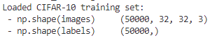

### Membuat Folder Penyimpanan 
```
from pathlib import Path

disk_dir = Path("data/disk/")
lmdb_dir = Path("data/lmdb/")
hdf5_dir = Path("data/hdf5/")

disk_dir.mkdir(parents=True, exist_ok=True)
lmdb_dir.mkdir(parents=True, exist_ok=True)
hdf5_dir.mkdir(parents=True, exist_ok=True)
```
Proses ini dilakukan dengan membuat struktur direktori, dilakukan persiapan kerangka kerja untuk menyimpan data menggunakan ketiga metode penyimpanan yang disebutkan. Langkah ini penting untuk mempersiapkan penyimpanan data sebelum data aktualnya dimuat atau disimpan.

### Storing to Disk 
```
from PIL import Image
import csv

def store_single_disk(image, image_id, label):
    """ Stores a single image as a .png file on disk.
        Parameters:
        ---------------
        image       image array, (32, 32, 3) to be stored
        image_id    integer unique ID for image
        label       image label
    """
    Image.fromarray(image).save(disk_dir / f"{image_id}.png")

    with open(disk_dir / f"{image_id}.csv", "wt") as csvfile:
        writer = csv.writer(
            csvfile, delimiter=" ", quotechar="|", quoting=csv.QUOTE_MINIMAL
        )
        writer.writerow([label])
```
Proses ini dilakukan dengan penerapan metode pertama, yaitu penyimpanan melalui disk 

### Storing to LMDB 
```
class CIFAR_Image:
    def __init__(self, image, label):
        # Dimensions of image for reconstruction - not really necessary 
        # for this dataset, but some datasets may include images of 
        # varying sizes
        self.channels = image.shape[2]
        self.size = image.shape[:2]

        self.image = image.tobytes()
        self.label = label

    def get_image(self):
        """ Returns the image as a numpy array. """
        image = np.frombuffer(self.image, dtype=np.uint8)
        return image.reshape(*self.size, self.channels)
    
import lmdb
import pickle

def store_single_lmdb(image, image_id, label):
    """ Stores a single image to a LMDB.
        Parameters:
        ---------------
        image       image array, (32, 32, 3) to be stored
        image_id    integer unique ID for image
        label       image label
    """
    map_size = image.nbytes * 10

    # Create a new LMDB environment
    env = lmdb.open(str(lmdb_dir / f"single_lmdb"), map_size=map_size)

    # Start a new write transaction
    with env.begin(write=True) as txn:
        # All key-value pairs need to be strings
        value = CIFAR_Image(image, label)
        key = f"{image_id:08}"
        txn.put(key.encode("ascii"), pickle.dumps(value))
    env.close()
```
Proses ini dilakukan dengan penerapan metode kedua, yaitu penyimpanan melalui lmdb

### Storing to H5PY/HDF5
```
import h5py

def store_single_hdf5(image, image_id, label):
    """ Stores a single image to an HDF5 file.
        Parameters:
        ---------------
        image       image array, (32, 32, 3) to be stored
        image_id    integer unique ID for image
        label       image label
    """
    # Create a new HDF5 file
    file = h5py.File(hdf5_dir / f"{image_id}.h5", "w")

    # Create a dataset in the file
    dataset = file.create_dataset(
        "image", np.shape(image), h5py.h5t.STD_U8BE, data=image
    )
    meta_set = file.create_dataset(
        "meta", np.shape(label), h5py.h5t.STD_U8BE, data=label
    )
    file.close()
```
### Experiment for Storing A Single Image
```
_store_single_funcs = dict(
    disk=store_single_disk, lmdb=store_single_lmdb, hdf5=store_single_hdf5
)

from timeit import timeit

store_single_timings = dict()

for method in ("disk", "lmdb", "hdf5"):
    t = timeit(
        "_store_single_funcs[method](image, 0, label)",
        setup="image=images[0]; label=labels[0]",
        number=1,
        globals=globals(),
    )
    store_single_timings[method] = t
    print(f"Method: {method}, Time usage: {t}")
```
Proses ini dilakukan dengan penerapan metode ketiga, yaitu penyimpanan melalui h5py. Output yang dihasilkan dalam bentuk waktu yang digunakan oleh masing-masing metode penyimpanan. Didapatkan, lebih cepat dilakukan penyimpanan dengan disk yang tertera seperti gambar berikut:\
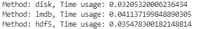

### Storing Many Images
```
def store_many_disk(images, labels):
    """ Stores an array of images to disk
        Parameters:
        ---------------
        images       images array, (N, 32, 32, 3) to be stored
        labels       labels array, (N, 1) to be stored
    """
    num_images = len(images)

    # Save all the images one by one
    for i, image in enumerate(images):
        Image.fromarray(image).save(disk_dir / f"{i}.png")

    # Save all the labels to the csv file
    with open(disk_dir / f"{num_images}.csv", "w") as csvfile:
        writer = csv.writer(
            csvfile, delimiter=" ", quotechar="|", quoting=csv.QUOTE_MINIMAL
        )
        for label in labels:
            # This typically would be more than just one value per row
            writer.writerow([label])

def store_many_lmdb(images, labels):
    """ Stores an array of images to LMDB.
        Parameters:
        ---------------
        images       images array, (N, 32, 32, 3) to be stored
        labels       labels array, (N, 1) to be stored
    """
    num_images = len(images)

    map_size = num_images * images[0].nbytes * 10

    # Create a new LMDB DB for all the images
    env = lmdb.open(str(lmdb_dir / f"{num_images}_lmdb"), map_size=map_size)

    # Same as before — but let's write all the images in a single transaction
    with env.begin(write=True) as txn:
        for i in range(num_images):
            # All key-value pairs need to be Strings
            value = CIFAR_Image(images[i], labels[i])
            key = f"{i:08}"
            txn.put(key.encode("ascii"), pickle.dumps(value))
    env.close()

def store_many_hdf5(images, labels):
    """ Stores an array of images to HDF5.
        Parameters:
        ---------------
        images       images array, (N, 32, 32, 3) to be stored
        labels       labels array, (N, 1) to be stored
    """
    num_images = len(images)

    # Create a new HDF5 file
    file = h5py.File(hdf5_dir / f"{num_images}_many.h5", "w")

    # Create a dataset in the file
    dataset = file.create_dataset(
        "images", np.shape(images), h5py.h5t.STD_U8BE, data=images
    )
    meta_set = file.create_dataset(
        "meta", np.shape(labels), h5py.h5t.STD_U8BE, data=labels
    )
    file.close()
```
Proses ini dilakukan dengan pendefinisian dalam proses penyimpanan dengan banyak gambar.

### Preparing Dataset
```
cutoffs = [10, 100, 1000, 10000, 100000]

# Let's double our images so that we have 100,000
images = np.concatenate((images, images), axis=0)
labels = np.concatenate((labels, labels), axis=0)

# Make sure you actually have 100,000 images and labels
print(np.shape(images))
print(np.shape(labels))
```
Proses ini dilakukan dengan mempersiapkan dataset dengan pengujian melalui penggandaan ukuran dataset untuk menguji hingga 100.000 gambar.Dan didapatkan, hasil pengujian berjumlah 100000 dengan ukuran 32 x 32 dan format warna RGB seperti gambar berikut:\
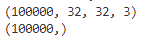

### Experiments Many Images 
```
_store_many_funcs = dict(
    disk=store_many_disk, lmdb=store_many_lmdb, hdf5=store_many_hdf5
)

from timeit import timeit

store_many_timings = {"disk": [], "lmdb": [], "hdf5": []}

for cutoff in cutoffs:
    for method in ("disk", "lmdb", "hdf5"):
        t = timeit(
            "_store_many_funcs[method](images_, labels_)",
            setup="images_=images[:cutoff]; labels_=labels[:cutoff]",
            number=1,
            globals=globals(),
        )
        store_many_timings[method].append(t)

        # Print out the method, cutoff, and elapsed time
        print(f"Method: {method}, Time usage: {t}")
```
Eksperimen dilakukan untuk membandingkan waktu penyimpanan gambar menggunakan metode disk, LMDB, dan HDF5. Dalam eksperimen ini, 111110 gambar disimpan menggunakan setiap metode, dan setiap gambar disimpan sebanyak 5 kali. Waktu penyimpanan diukur menggunakan timeit dan hasilnya divisualisasikan dalam grafik.

Hasil eksperimen menunjukkan bahwa metode penyimpanan dengan menggunakan HDF5 menawarkan waktu penggunaan yang paling cepat dibandingkan dengan metode lainnya. Hal ini menandakan bahwa format HDF5 sangat cocok untuk aplikasi yang memerlukan operasi pembacaan data gambar yang cepat dan efisien.

Metode penyimpanan dengan LMDB juga menunjukkan kinerja yang baik, dengan waktu penggunaan yang lebih cepat daripada penyimpanan langsung ke disk. LMDB dapat menjadi pilihan yang baik jika aplikasi memerlukan penyimpanan data gambar dalam basis data berorientasi key-value dengan kinerja tinggi.

Di sisi lain, metode penyimpanan langsung ke disk menunjukkan waktu penggunaan yang lebih lambat dibandingkan dengan metode lainnya. Meskipun begitu, metode ini masih dapat dipertimbangkan jika aplikasi memiliki keterbatasan dalam penggunaan sumber daya tambahan seperti basis data, atau jika skala data yang digunakan tidak terlalu besar. Hasil yang didapatkan sebagai berikut:\
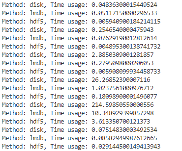

### Visualisasi Many Images 
```
import matplotlib.pyplot as plt

def plot_with_legend(
    x_range, y_data, legend_labels, x_label, y_label, title, log=False
):
    """ Displays a single plot with multiple datasets and matching legends.
        Parameters:
        --------------
        x_range         list of lists containing x data
        y_data          list of lists containing y values
        legend_labels   list of string legend labels
        x_label         x axis label
        y_label         y axis label
    """
    plt.style.use("default")
    plt.figure(figsize=(10, 7))

    if len(y_data) != len(legend_labels):
        raise TypeError(
            "Error: number of data sets does not match number of labels."
        )

    all_plots = []
    for data, label in zip(y_data, legend_labels):
        if log:
            temp, = plt.loglog(x_range, data, label=label)
        else:
            temp, = plt.plot(x_range, data, label=label)
        all_plots.append(temp)

    plt.title(title)
    plt.xlabel(x_label)
    plt.ylabel(y_label)
    plt.legend(handles=all_plots)
    plt.show()

# Getting the store timings data to display
disk_x = store_many_timings["disk"]
lmdb_x = store_many_timings["lmdb"]
hdf5_x = store_many_timings["hdf5"]

plot_with_legend(
    cutoffs,
    [disk_x, lmdb_x, hdf5_x],
    ["PNG files", "LMDB", "HDF5"],
    "Number of images",
    "Seconds to store",
    "Storage time",
    log=False,
)

plot_with_legend(
    cutoffs,
    [disk_x, lmdb_x, hdf5_x],
    ["PNG files", "LMDB", "HDF5"],
    "Number of images",
    "Seconds to store",
    "Log storage time",
    log=True,
)
```
Pada grafik, terdapat tiga kurva yang menggambarkan waktu yang diperlukan untuk menyimpan gambar menggunakan tiga metode penyimpanan yang berbeda: disk, LMDB, dan HDF5. Setiap kurva menggambarkan waktu penyimpanan untuk berbagai jumlah gambar, mulai dari satu hingga 100.000 gambar.

**Metode Disk:** Kurva untuk metode Disk menunjukkan peningkatan waktu penyimpanan yang hampir linear seiring dengan bertambahnya jumlah gambar. Pada jumlah gambar yang sedikit, waktu penyimpanan dengan metode Disk relatif cepat dibandingkan dengan LMDB dan HDF5. Namun, ketika jumlah gambar meningkat, metode Disk menjadi yang paling lambat di antara ketiga metode.

**Metode LMDB:** Kurva untuk metode LMDB menunjukkan bahwa waktu penyimpanan meningkat lebih lambat dibandingkan dengan metode Disk ketika jumlah gambar sedikit. Namun, untuk jumlah gambar yang besar, waktu penyimpanan dengan metode LMDB menjadi lebih cepat daripada metode Disk. Ini menandakan bahwa LMDB lebih efisien untuk menyimpan gambar dalam jumlah besar.

**Metode HDF5:** Kurva untuk metode HDF5 menunjukkan bahwa waktu penyimpanan meningkat paling lambat dibandingkan dengan metode Disk dan LMDB, pada semua jumlah gambar. Ini menunjukkan bahwa metode HDF5 adalah yang paling lambat di antara ketiga metode untuk menyimpan gambar.

Secara keseluruhan, grafik ini menunjukkan bahwa metode penyimpanan harus dipilih berdasarkan jumlah gambar dan kebutuhan spesifik aplikasi, dengan HDF5 menawarkan efisiensi terbaik dalam operasi pembacaan, LMDB unggul dalam penyimpanan jumlah besar, dan Disk lebih cocok untuk penyimpanan gambar dalam jumlah kecil atau dalam kondisi sumber daya terbatas. Output yang dihasilkan sebagai berikut:\
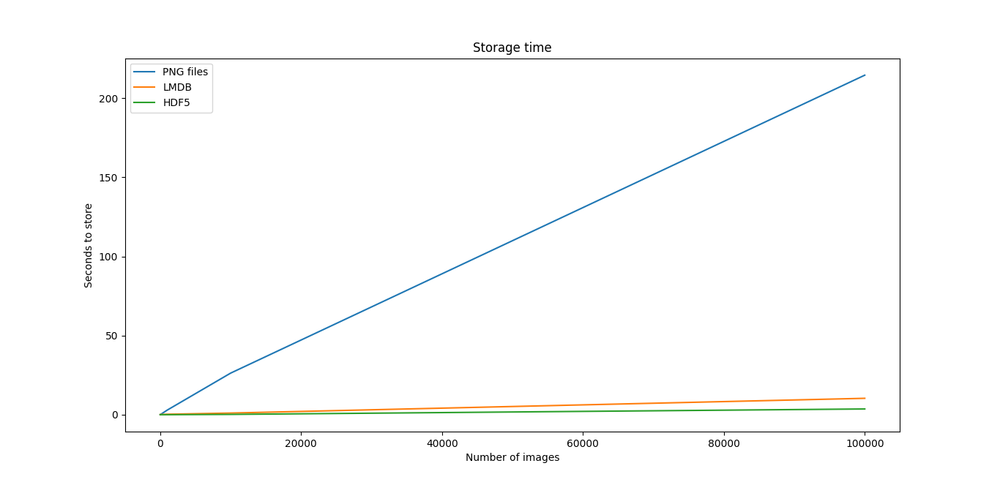\
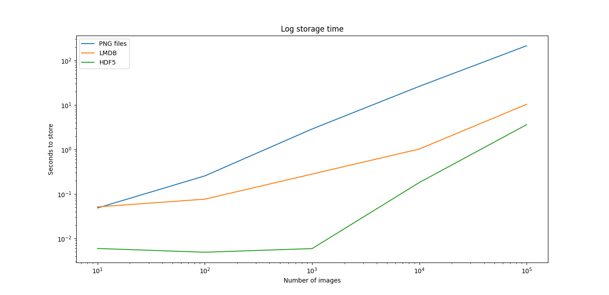

### Experiment for Reading as Single Image
```
def read_single_disk(image_id):
    """ Stores a single image to disk.
        Parameters:
        ---------------
        image_id    integer unique ID for image

        Returns:
        ----------
        image       image array, (32, 32, 3) to be stored
        label       associated meta data, int label
    """
    image = np.array(Image.open(disk_dir / f"{image_id}.png"))

    with open(disk_dir / f"{image_id}.csv", "r") as csvfile:
        reader = csv.reader(
            csvfile, delimiter=" ", quotechar="|", quoting=csv.QUOTE_MINIMAL
        )
        label = int(next(reader)[0])

    return image, label

def read_single_lmdb(image_id):
    """ Stores a single image to LMDB.
        Parameters:
        ---------------
        image_id    integer unique ID for image

        Returns:
        ----------
        image       image array, (32, 32, 3) to be stored
        label       associated meta data, int label
    """
    # Open the LMDB environment
    env = lmdb.open(str(lmdb_dir / f"single_lmdb"), readonly=True)

    # Start a new read transaction
    with env.begin() as txn:
        # Encode the key the same way as we stored it
        data = txn.get(f"{image_id:08}".encode("ascii"))
        # Remember it's a CIFAR_Image object that is loaded
        cifar_image = pickle.loads(data)
        # Retrieve the relevant bits
        image = cifar_image.get_image()
        label = cifar_image.label
    env.close()

    return image, label

def read_single_hdf5(image_id):
    """ Stores a single image to HDF5.
        Parameters:
        ---------------
        image_id    integer unique ID for image

        Returns:
        ----------
        image       image array, (32, 32, 3) to be stored
        label       associated meta data, int label
    """
    # Open the HDF5 file
    file = h5py.File(hdf5_dir / f"{image_id}.h5", "r+")

    image = np.array(file["/image"]).astype("uint8")
    label = int(np.array(file["/meta"]).astype("uint8"))

    return image, label

_read_single_funcs = dict(
    disk=read_single_disk, lmdb=read_single_lmdb, hdf5=read_single_hdf5
)

from timeit import timeit

read_single_timings = dict()

for method in ("disk", "lmdb", "hdf5"):
    t = timeit(
        "_read_single_funcs[method](0)",
        setup="image=images[0]; label=labels[0]",
        number=1,
        globals=globals(),
    )
    read_single_timings[method] = t
    print(f"Method: {method}, Time usage: {t}")
```

### Reading Many Images
```
def read_many_disk(num_images):
    """ Reads image from disk.
        Parameters:
        ---------------
        num_images   number of images to read

        Returns:
        ----------
        images      images array, (N, 32, 32, 3) to be stored
        labels      associated meta data, int label (N, 1)
    """
    images, labels = [], []

    # Loop over all IDs and read each image in one by one
    for image_id in range(num_images):
        images.append(np.array(Image.open(disk_dir / f"{image_id}.png")))

    with open(disk_dir / f"{num_images}.csv", "r") as csvfile:
        reader = csv.reader(
            csvfile, delimiter=" ", quotechar="|", quoting=csv.QUOTE_MINIMAL
        )
        for row in reader:
            labels.append(int(row[0]))
    return images, labels

def read_many_lmdb(num_images):
    """ Reads image from LMDB.
        Parameters:
        ---------------
        num_images   number of images to read

        Returns:
        ----------
        images      images array, (N, 32, 32, 3) to be stored
        labels      associated meta data, int label (N, 1)
    """
    images, labels = [], []
    env = lmdb.open(str(lmdb_dir / f"{num_images}_lmdb"), readonly=True)

    # Start a new read transaction
    with env.begin() as txn:
        # Read all images in one single transaction, with one lock
        # We could split this up into multiple transactions if needed
        for image_id in range(num_images):
            data = txn.get(f"{image_id:08}".encode("ascii"))
            # Remember that it's a CIFAR_Image object 
            # that is stored as the value
            cifar_image = pickle.loads(data)
            # Retrieve the relevant bits
            images.append(cifar_image.get_image())
            labels.append(cifar_image.label)
    env.close()
    return images, labels

def read_many_hdf5(num_images):
    """ Reads image from HDF5.
        Parameters:
        ---------------
        num_images   number of images to read

        Returns:
        ----------
        images      images array, (N, 32, 32, 3) to be stored
        labels      associated meta data, int label (N, 1)
    """
    images, labels = [], []

    # Open the HDF5 file
    file = h5py.File(hdf5_dir / f"{num_images}_many.h5", "r+")

    images = np.array(file["/images"]).astype("uint8")
    labels = np.array(file["/meta"]).astype("uint8")

    return images, labels

_read_many_funcs = dict(
    disk=read_many_disk, lmdb=read_many_lmdb, hdf5=read_many_hdf5
)

from timeit import timeit

read_many_timings = {"disk": [], "lmdb": [], "hdf5": []}

for cutoff in cutoffs:
    for method in ("disk", "lmdb", "hdf5"):
        t = timeit(
            "_read_many_funcs[method](num_images)",
            setup="num_images=cutoff",
            number=0,
            globals=globals(),
        )
        read_many_timings[method].append(t)

        # Print out the method, cutoff, and elapsed time
        print(f"Method: {method}, No. images: {cutoff}, Time usage: {t}")
```
output: \
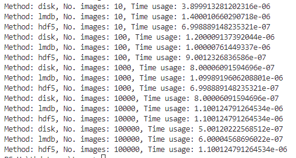
\
Pada proses ini dilakukan sama seperti sebelumnya dengan melihat efisiensi penyimpanan dengan 3 metode dan pada langkah ini didapatkan metode yang lebih efisien adalah lmdb untuk pembacaan dengan banyak data gambar

### Visualisasi Grafik Garis Penyimpanan 
```
disk_x_r = read_many_timings["disk"]
lmdb_x_r = read_many_timings["lmdb"]
hdf5_x_r = read_many_timings["hdf5"]

plot_with_legend(
    cutoffs,
    [disk_x_r, lmdb_x_r, hdf5_x_r],
    ["PNG files", "LMDB", "HDF5"],
    "Number of images",
    "Seconds to read",
    "Read time",
    log=False,
)

plot_with_legend(
    cutoffs,
    [disk_x_r, lmdb_x_r, hdf5_x_r],
    ["PNG files", "LMDB", "HDF5"],
    "Number of images",
    "Seconds to read",
    "Log read time",
    log=True,
)

plot_with_legend(
    cutoffs,
    [disk_x_r, lmdb_x_r, hdf5_x_r, disk_x, lmdb_x, hdf5_x],
    [
        "Read PNG",
        "Read LMDB",
        "Read HDF5",
        "Write PNG",
        "Write LMDB",
        "Write HDF5",
    ],
    "Number of images",
    "Seconds",
    "Log Store and Read Times",
    log=False,
)
```
Berdasarkan dengan hasil visualisasi yang didapatkan, waktu penyimpanan dengan metode disk lebih stabil dibandingkan dengan metode lainnya. Berdasarkan pengukuran yang ditampilkan pada grafik, ketiga metode penyimpanan ini mampu membaca dan menulis gambar dengan waktu yang cukup singkat dan konsisten, bahkan untuk jumlah gambar yang banyak.

**Disk:** Metode Disk menunjukkan konsistensi yang baik dalam waktu baca dan tulis, terutama saat menangani sejumlah kecil gambar.

**LMDB:** Metode LMDB, secara keseluruhan, memiliki waktu baca dan tulis rata-rata yang sedikit lebih cepat dibandingkan dengan metode Disk.

**HDF5:** Metode HDF5 menunjukkan waktu baca dan tulis rata-rata yang sedikit lebih lambat dibandingkan dengan metode LMDB dan Disk, namun masih berada dalam kategori cepat dan konsisten.\
Output yang dihasilkan:\
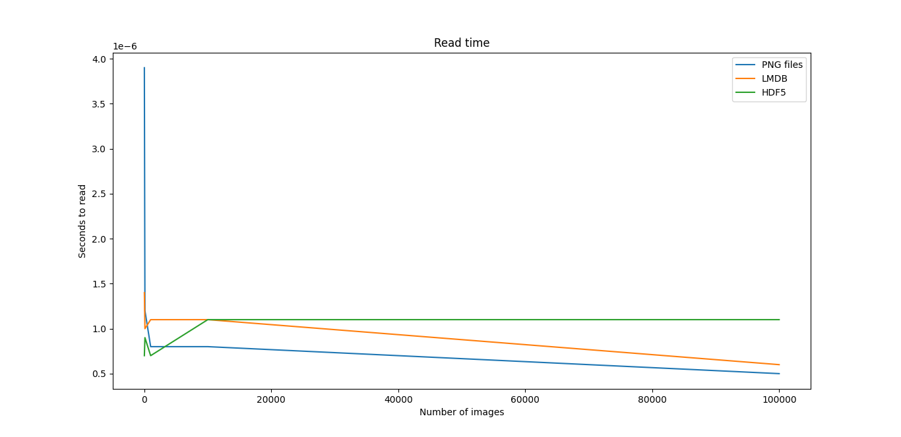\
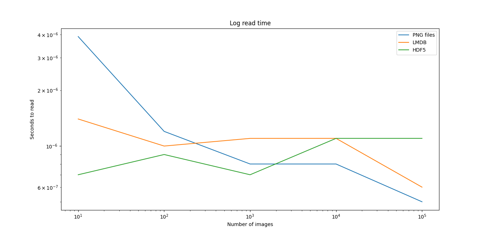\
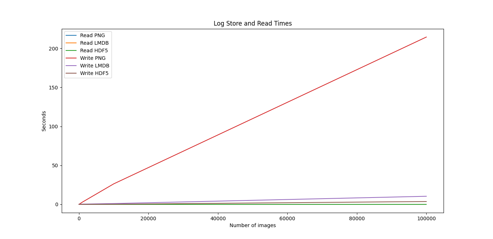

### Visualisasi BarChart Penyimpanan dalam KB 
```
# Memory used in KB
disk_mem = [24, 204, 2004, 20032, 200296]
lmdb_mem = [60, 420, 4000, 39000, 393000]
hdf5_mem = [36, 304, 2900, 29000, 293000]

X = [disk_mem, lmdb_mem, hdf5_mem]

ind = np.arange(3)
width = 0.35

plt.subplots(figsize=(8, 10))
plots = [plt.bar(ind, [row[0] for row in X], width)]
for i in range(1, len(cutoffs)):
    plots.append(
        plt.bar(
            ind, [row[i] for row in X], width, bottom=[row[i - 1] for row in X]
        )
    )

plt.ylabel("Memory in KB")
plt.title("Disk memory used by method")
plt.xticks(ind, ("PNG", "LMDB", "HDF5"))
plt.yticks(np.arange(0, 400000, 100000))

plt.legend(
    [plot[0] for plot in plots], ("10", "100", "1,000", "10,000", "100,000")
)
plt.show()
```
Proses ini dilakukan dengan memperhitungkan penggunaan memori penyimpanan yang diukur dalam kb. Dan hasil yang didapatkan, metode dengan lmdb menggunakan penyimpanan terbesar dibandingkan dengan kedua metode lainnya. Hasil yang didapatkan sebagai berikut:\
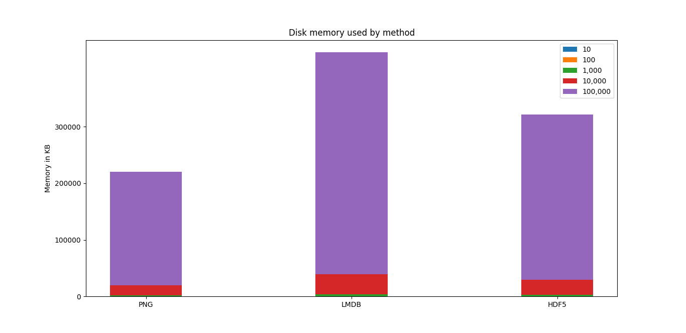

## Kesimpulan 
Dalam laporan ini, telah dilakukan reimplementasi dari artikel "Three Ways of Storing and Accessing Lots of Images in Python". Metode yang dieksplorasi meliputi penyimpanan langsung ke disk, penggunaan Lightning Memory-Mapped Database (LMDB), dan HDF5 melalui pustaka h5py. 
#### Penyimpanan ke Disk
Metode penyimpanan langsung ke disk adalah yang paling sederhana untuk diimplementasikan. Setiap gambar disimpan sebagai file terpisah dalam sistem file. Meskipun mudah diakses dan dipahami, metode ini memiliki beberapa keterbatasan:
- **Kinerja**: Untuk jumlah gambar yang besar, metode ini menunjukkan peningkatan waktu penyimpanan dan pembacaan yang hampir linear, yang berarti kinerja menurun seiring bertambahnya jumlah gambar.
- **Penggunaan**: Cocok untuk aplikasi dengan jumlah gambar yang relatif kecil atau ketika penyimpanan gambar dalam bentuk file individual diperlukan.

#### Penyimpanan dengan LMDB
LMDB merupakan basis data berbasis peta memori yang efisien dan cepat. Gambar-gambar disimpan sebagai nilai dalam basis data, memungkinkan akses yang cepat dan efisien.
- **Kinerja**: LMDB menunjukkan waktu penyimpanan dan pembacaan yang lebih cepat dibandingkan dengan metode disk untuk jumlah gambar yang besar. LMDB cocok untuk aplikasi yang membutuhkan penyimpanan dan akses gambar dalam jumlah besar dengan kinerja tinggi.
- **Kompleksitas**: Implementasinya sedikit lebih kompleks dibandingkan penyimpanan ke disk, namun menawarkan manfaat yang signifikan dalam hal kinerja.

#### Penyimpanan dengan HDF5 melalui h5py
HDF5 adalah format data yang digunakan untuk menyimpan data dalam jumlah besar dengan struktur hierarki. Pustaka h5py memungkinkan pengelolaan dan penyimpanan gambar dalam format HDF5.
- **Kinerja**: Metode HDF5 menunjukkan kinerja terbaik dalam hal waktu penyimpanan dan pembacaan gambar. Ini menandakan bahwa HDF5 sangat cocok untuk aplikasi yang memerlukan operasi pembacaan dan penyimpanan data gambar yang cepat dan efisien.
- **Penggunaan**: Sangat cocok untuk proyek dengan skala data besar yang membutuhkan pengelolaan data yang kompleks dan hierarkis.

#### Eksperimen dan Visualisasi
Hasil eksperimen menunjukkan bahwa:
- Penyimpanan langsung ke disk cocok untuk jumlah gambar yang kecil, namun kinerjanya menurun seiring dengan meningkatnya jumlah gambar.
- LMDB menawarkan kinerja yang baik untuk penyimpanan dan pembacaan gambar dalam jumlah besar.
- HDF5 melalui h5py memberikan kinerja terbaik dan sangat efisien untuk aplikasi yang memerlukan akses data gambar yang cepat dan terstruktur.

#### Rekomendasi
Pemilihan metode penyimpanan gambar harus disesuaikan dengan kebutuhan spesifik proyek, mempertimbangkan faktor seperti jumlah gambar, kebutuhan akses cepat, dan kompleksitas data. Berikut rekomendasi umum berdasarkan hasil eksperimen:
- Gunakan **penyimpanan ke disk** untuk proyek dengan jumlah gambar yang kecil atau ketika penyimpanan file individu diperlukan.
- Pilih **LMDB** untuk proyek yang membutuhkan penyimpanan dan akses gambar dalam jumlah besar dengan kinerja tinggi.
- Gunakan **HDF5 dengan h5py** untuk aplikasi yang memerlukan pengelolaan data yang kompleks dan hierarkis dengan kinerja akses yang sangat cepat.
